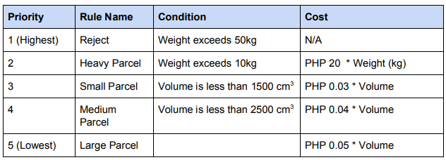

<!-- PROJECT LOGO -->
<br />
<div align="center">
  <a href="D:/Documents/mynt_programming_exam/delivery-parcel/">
    
  </a>

<h3 align="center">Java Programming Exam</h3>
 
</div>

## About The API 
<h3>Objective</h3>
Create a Spring Boot application that provides an API as described below. The application
should be clean, well designed, and maintainable.

Instructions
Create an API that will calculate the cost of delivery of a parcel based on weight and volume
(volume = height * width * length). The API should accept the following:
1. Weight (kg)
2. Height (cm)
3. Width (cm)
4. Length (cm)


   The rules for calculating the cost of delivery are in order of priority:

  <a href="D:/Documents/mynt_programming_exam/delivery-parcel/">
    
  </a>


As the market tends to fluctuate in terms of pricing, the rules needs to be as flexible as possible.
Your API should also accept a voucher code that can be used to provide discounts to the
customer. To get the discount details of the submitted voucher code, you will need to integrate
with the voucher service maintained by another team. You may check their Voucher API
definition [here](https://app.swaggerhub.com/apis/mynt-iat/mynt-programming-exams/1.1.0). This also includes the details of the mock server that they have provided for your
testing.

<!-- GETTING STARTED -->
## Getting Started

Below are the instruction on how you will run the application. 

### Prerequisites
  
install JDK 17 and follow the instruction [here](https://docs.oracle.com/cd/E19062-01/sun.mgmt.ctr36/819-5418/6n7gk6imj/index.html).
  

### Installation

Below is the instruction on how we will run the application:

1. Clone the repo
   ```sh
   git clone https://github.com/adrianbaduria/delivery-parcel-mynt.git
   ```
2. Run the jar file located on the target folder
   ```sh
   java -jar delivery-parcel-0.0.1-SNAPSHOT.jar
   ```
3. Open the swagger in the browser:
   ```js
   http://localhost:8080/swagger-ui/index.html/
   ```


<!-- CONTACT -->
## Contact

linkedin - [@adrian.baduria](https://www.linkedin.com/in/adrian-baduria/) - adrian.baduria@gmail.com

Mobile Number: 0917-728-0924

Project Link: [delivery-parcel](https://github.com/adrianbaduria/delivery-parcel-mynt.git)

